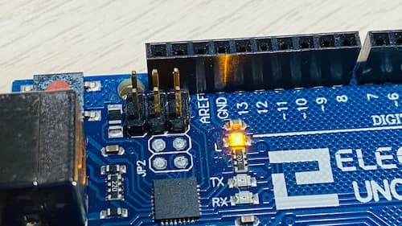

# Arduino uno

It uses [atmega328p](./atmega-328p.md) under the hood.

## Pinout
| Arduino pin | Atmega328P | Additional Functions | INT | PCINT | PCMSK |
| --- | --- | --- | --- | --- | -- |
| D2 | PD2 | | INT0 | PCINT18 | PCMSK2 |
| D3 | PD3 | | INT0 | PCINT19 | PCMSK2 |
| D4 | PD4 | | | PCINT20 | PCMSK2 |
| D5 | PD5 | | | PCINT21 | PCMSK2 |
| D6 | PD6 | | | PCINT22 | PCMSK2 |
| D7 | PD7 | | | PCINT23 | PCMSK2 |
| D8 | PB0 | | | PCINT0 | PCMSK0 |
| D9 | PB1 | | | PCINT1 | PCMSK0 |
| D10 | PB2 | | | PCINT2 | PCMSK0 |
| D11 | PB3 | | | PCINT3 | PCMSK0 |
| D12 | PB4 | | | PCINT4 | PCMSK0 |
| D13 | PB5 | Builtin Led | | PCINT5 | PCMSK0 |

## Pull up resistor

All pins has pull up resistors (need to set pin as input mode and set high value)

## Powering

More details [here](https://docs.arduino.cc/learn/electronics/power-pins)

### USB Connector

Uno has usb connector type A/B

Can be powered:
- from laptop;
- from power bank;

## Built-in LED

Arduino UNO has built-in LED on PIN 13 (PB5)

