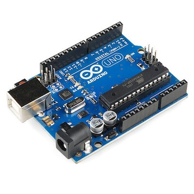
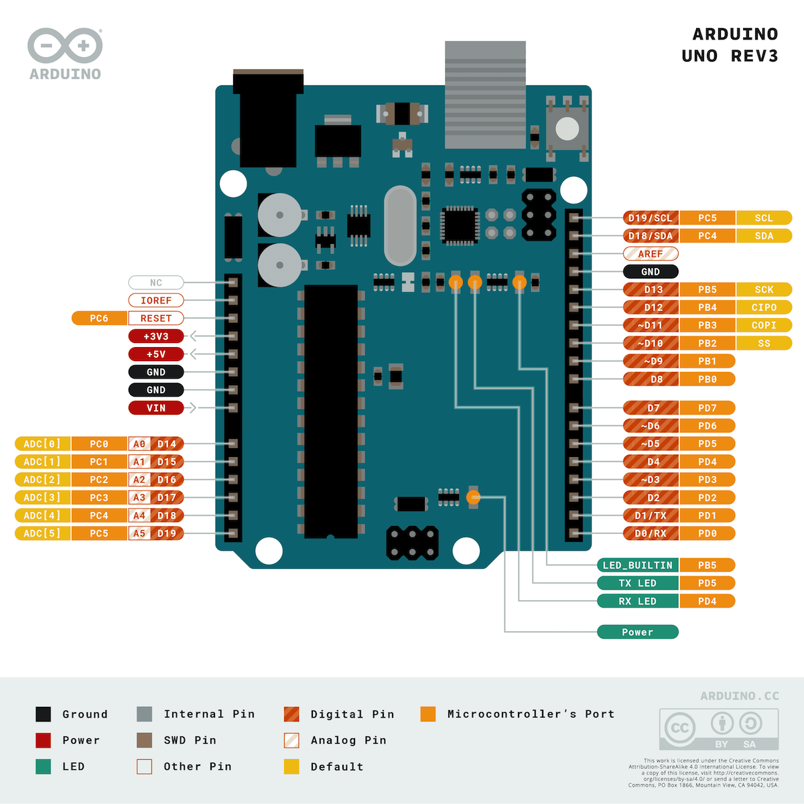

# Arduino uno
It uses [atmega328p](./atmega-328p.md) under the hood.

Datasheet [link](./assets/arduino-uno-r3-datasheet.pdf).

## Pinout
| Arduino pin | Atmega328P | Additional Functions | INT  | PCINT   | PCMSK  | PWM  | SPI         |
| ----------- | ---------- | -------------------- | ---- | ------- | ------ | ---- | ----------- |
| D2          | PD2        |                      | INT0 | PCINT18 | PCMSK2 |      |             |
| D3          | PD3        |                      | INT1 | PCINT19 | PCMSK2 |      |             |
| D4          | PD4        |                      |      | PCINT20 | PCMSK2 |      |             |
| D5          | PD5        |                      |      | PCINT21 | PCMSK2 | OC0B |             |
| D6          | PD6        |                      |      | PCINT22 | PCMSK2 | OC0A |             |
| D7          | PD7        |                      |      | PCINT23 | PCMSK2 |      |             |
| D8          | PB0        |                      |      | PCINT0  | PCMSK0 |      |             |
| D9          | PB1        |                      |      | PCINT1  | PCMSK0 |      |             |
| D10         | PB2        |                      |      | PCINT2  | PCMSK0 |      | SS, (LATCH) |
| D11         | PB3        |                      |      | PCINT3  | PCMSK0 |      | MOSI, PICO  |
| D12         | PB4        |                      |      | PCINT4  | PCMSK0 |      | MISO, POCI  |
| D13         | PB5        | Builtin Led          |      | PCINT5  | PCMSK0 |      | SCK         |
| D14 (A0)    | PC0        | ADC                  |      |         |        |      |             |
| D15 (A1)    | PC1        | ADC                  |      |         |        |      |             |
| D16 (A2)    | PC2        | ADC                  |      |         |        |      |             |
| D17 (A3)    | PC3        | ADC                  |      |         |        |      |             |
| D18 (A4)    | PC4        | ADC                  |      |         |        |      |             |
| D19 (A5)    | PC5        | ADC                  |      |         |        |      |             |

## Pull up resistor

All pins has pull up resistors (need to set pin as input mode and set high value)

## Powering

More details [here](https://docs.arduino.cc/learn/electronics/power-pins)

### USB Connector

Uno has usb connector type A/B

Can be powered:
- from laptop;
- from power bank;

## Built-in LED

Arduino UNO has built-in LED on PIN 13 (PB5)

