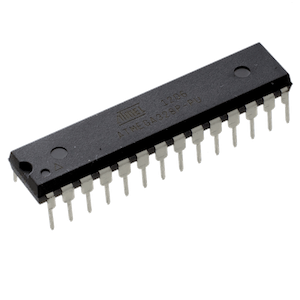
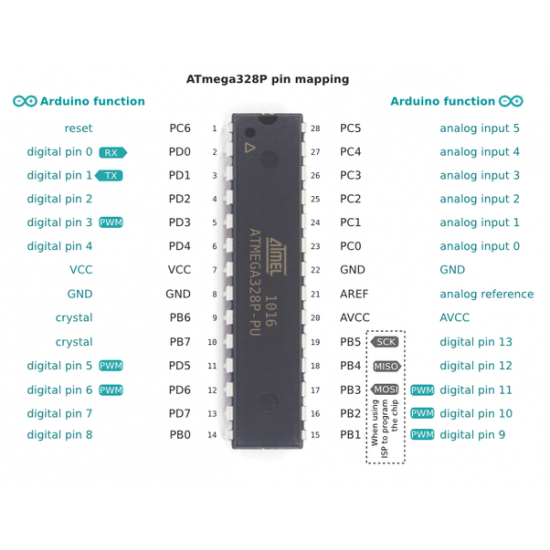

# Atmega-328p

Datasheet [link](./assets/atmega-328p-datasheet.pdf)

## Pinout

## Params
| Parameter | Value |
| --- | --- |
| CPU type | 8-bit |
| CPU speed | 16MHz |
| Flash memory | 32 KB |

## Ports
Atmega-328P has 3 ports, B, C and D.
B - 8 bits, C - 7 bits. D - 8 bits.

## P suffix
P - means PicoPower Technology PicoPower technology is a set of features that help reduce power consumption in low-power applications. It allows the ATmega328P to operate at lower power levels and sleep modes, making it more suitable for battery-powered or energy-efficient devices.

