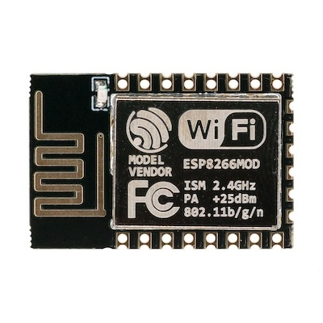
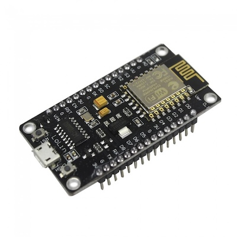

# ESP8266
The ESP8266 is a low-cost, low-power system-on-a-chip (SoC) microcontroller with built-in Wi-Fi capabilities. It was developed by the Chinese company Espressif Systems and gained widespread popularity in the maker and IoT communities due to its affordability and ease of use.

Has `WiFi`, but not `BLE`.

Datasheet [link](./assets/esp8266-datasheet.pdf)

## Params
| Parameter    | Value                 |
| ------------ | --------------------- |
| Processor    | ESP8266               |
| CPU speed    | 80MHz                 |
| Flash memory | 4MB                   |
| Wifi         | WiFi 802.11 b / g / n |

## NodeMcu board V3 Lolin
Has USB-Serial `CH340G` (micro usb), and has power 3.3 V.

### NodeMcu pinout
