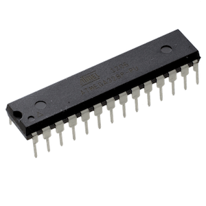
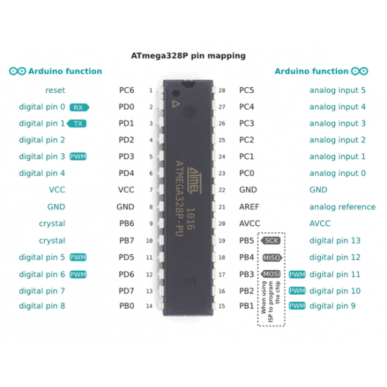

# Atmega-328p

Datasheet [link](./assets/atmega-328p-datasheet.pdf)

## Pinout

| Pin # | Name | Functions              |
| ----- | ---- | ---------------------- |
| 1     | PC6  | Reset                  |
| 2     | PD0  | Digital Pin, RX        |
| 3     | PD1  | Digital Pin, TX        |
| 4     | PD2  | Digital Pin            |
| 5     | PD3  | Digital Pin, PWM       |
| 6     | PD4  | Digital Pin            |
| 7     | VCC  | VCC                    |
| 8     | GND  | GND                    |
| 9     | PB6  | Crystal                |
| 10    | PB7  | Crystal                |
| 11    | PD5  | Digital Pin, PWM       |
| 12    | PD6  | Digital Pin, PWM       |
| 13    | PD7  | Digital Pin            |
| 14    | PB0  | Digital Pin            |
| 15    | PB1  | Digital Pin, PWM       |
| 16    | PB2  | Digital Pin, PWM       |
| 17    | PB3  | Digital Pin, PWM, MOSI |
| 18    | PB4  | Digital Pin, MISO      |
| 19    | PB5  | Digital Pin, SCK       |
| 20    | AVCC | AVCC                   |
| 21    | AREF | Analog reference       |
| 22    | GND  | GND                    |
| 23    | PC0  | Analog Input           |
| 24    | PC1  | Analog Input           |
| 25    | PC2  | Analog Input           |
| 26    | PC3  | Analog Input           |
| 27    | PC4  | Analog Input           |
| 28    | PC5  | Analog Input           |

## Params
| Parameter    | Value |
| ------------ | ----- |
| CPU type     | 8-bit |
| CPU speed    | 16MHz |
| Flash memory | 32 KB |

## Ports
Atmega-328P has 3 ports, B, C and D.
B - 8 bits, C - 7 bits. D - 8 bits.

## Features
- Timers. Three timers, two 8-bit and one 16-bit
- Hardware SPI
- External Interrupts. Two
- Pin change interrupts. By ports
- ADC converter. 10 bits

## P suffix
P - means PicoPower Technology PicoPower technology is a set of features that help reduce power consumption in low-power applications. It allows the ATmega328P to operate at lower power levels and sleep modes, making it more suitable for battery-powered or energy-efficient devices.

