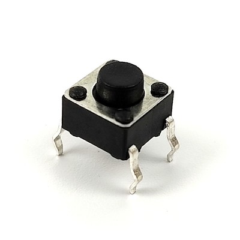
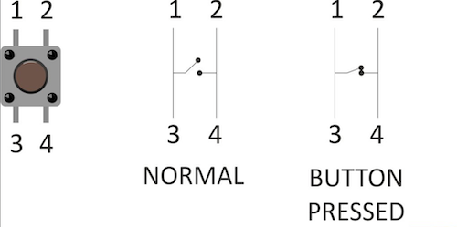
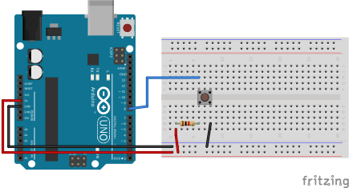
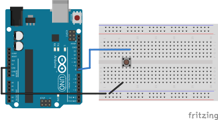
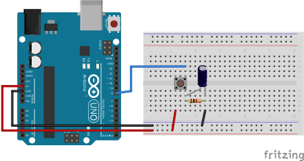

# 4 pin button
4 Pin Button has 4 pins. 



## How it works
Two pins on left connected, and two right connected when button is unpressed.
When button is pressed left and right pins are connected.



## Floating Inputs
When a digital input is left unconnected or is in a high-impedance state, it can "float" and pick up electrical noise. A pull-up or pull-down resistor provides a defined voltage level to ensure that the input is in a known state, either logic high or logic low.

### Pull-up resistor
Pull-up resistor ensures that the signal line remains at a known logic level when it's not being actively driven, a pull-up resistor is connected between the signal line and the supply voltage (usually Vcc). The pull-up resistor pulls the line to the logic high state (usually 1 or Vcc) when it's not being actively pulled low by the device. Resistor value 4.7 kOm is perfect, but any from 1kOm to 10kOm will work.

So when button is not pressed, PIN will have 1, if pressed - 0.




### Pull-down resistor
Pull-down resistors work in the same manner as pull-up resistors, except that they pull the pin to a logical low value.
Resistor value 4.7 kOm is perfect, but any from 1kOm to 10kOm will work. 

So when button is not pressed, PIN will have 0, if pressed - 1.


### Internal pull-up resistor
Atmega328P micro controller (on Arduino UNO board) has built-in internal pull up resistor. To activate it, setup PIN in output mode and set value 1 on pin. For example:

```c
DDRB &= ~(1 << PB0);
PORTB |= 1 << PB0;
```

So when button is not pressed, PIN will have 1, if pressed - 0.



## Debounce button
Push buttons often generate spurious open/close transitions when pressed, due to mechanical and physical issues: these transitions may be read as multiple presses in a very short time fooling the program.

### Hardware debounce 
The combination of a resistor and capacitor in this circuit is referred to as an RC filter. RC filters can be used to filter out different frequencies of electrical variation.

Calculator for capacitor value [link](https://protological.com/debounce-calaculator/).
100uF and 1kOm should be fine.

So when button is not pressed, PIN will have 0, if pressed - 1.

**This Approach will not work for two buttons parallel. Prefer software debounce**



### Software debounce
Software debounce will check and ignore all changes in input state pin for specified time after state was change. Usually `50ms` should work. Precise debounce time can be achived with timers.

```c
#include <avr/interrupt.h>
#include <avr/io.h>
#include <stdbool.h>

const int btnPin = PB0;

void setupPins(void);
void setupBtnInterrupts(void);
void setupTimer(void);

volatile bool btnWasPressed = false;
volatile int counter = 0;
volatile int btnCounter = 0;

// Interrupt Service Routine (ISR) for INT0
ISR(PCINT0_vect) {
  bool btnPressed = bit_is_clear(PINB, btnPin);

  if ((btnPressed != btnPressed) 
    && (counter < (btnCounter + 4))) {
    return;
  }

  if (!btnPressed && btnWasPressed) {
    // do on something on btn pressed
  }


  btnWasPressed = btnPressed;
  btnCounter = counter;
}

ISR(TIMER0_OVF_vect) {
  counter++;
}

void setupExternalInterrupt(void);

int main(void) {
  setupPins();
  setupBtnInterrupts();
  setupTimer();

  sei();

  while (1);
}

void setupPins(void) {
  DDRB &= ~_BV(btnPin);
  PORTB |= _BV(btnPin); // Internal pull up resistor
}

void setupBtnInterrupts(void) {
  PCICR = (1 << PCIE0); // Enable PCI0
  PCMSK0 |= _BV(PCINT0) | _BV(PCINT1); // Enable PCINT0 (D8/PB0) and (D9/PB1) on PCI0
} 

void setupTimer(void) {
  TIMSK0 |= (1 << TOIE0); // timer 0 normal mode (8 bit)
  TCCR0B |= (1 << CS02) | (1 << CS00); // Set prescaler to 1024
}
```

## Schematic symbol


## Long Press/Short press
It's useful to use only one button, button for different functions, by difirintiating different presses for example by long or short press

Code example:
```c
#include <avr/io.h>
#include <avr/interrupt.h>
#include <stdio.h>
#include <stdbool.h>

const int btnPin = PD2;
volatile int counter = 0;

enum BtnPressType {
  SHORT_PRESS,
  LONG_PRESS
};

ISR(INT0_vect) {
  static int btnCounter = 0;
  static bool wasPressed = false;

  if (counter < btnCounter + 5) {
    return;
  }

  bool isPressed = bit_is_clear(PIND, btnPin); // button is high when not pressed

  if (wasPressed && !isPressed) {
    enum BtnPressType pressType =  counter - btnCounter > 15 ? LONG_PRESS : SHORT_PRESS;
  }

  btnCounter = counter;
  wasPressed = isPressed;
}

ISR(TIMER0_OVF_vect) {
  counter++;
}

void setup(void);
void setupButton(void);

int main(void) {
  setup();

  while (1);
}

void setup(void) {
  setupButtons();
}

void setupButton(void) {
  DDRD &= ~_BV(btnPin);
  PORTD |= _BV(btnPin);

  // External Interrupt INT0
  EIMSK |= _BV(INT0);
  EICRA |= _BV(ISC00);

  // Timer 0, 1024 prescaler, normal mode, 8-bit
  TIMSK0 |= (1 << TOIE0);
  TCCR0B |= (1 << CS02) | (1 << CS00);

  sei();
}
```