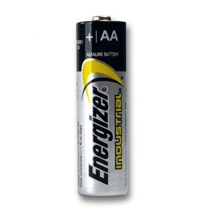

# Batteries

## AA
`AA` refers to a common size of dry cell battery. The typical dimensions of an AA battery are about 14.5–14.9 mm in diameter and 49.2–50.5 mm in length.

Has `1.5v`

## AAA
`AAA` refers to another common size of dry cell battery. Similar to `AA` batteries, `AAA` batteries are cylindrical and widely used in various electronic devices. `AAA` batteries are smaller than AA batteries, with typical dimensions of about 10.5–10.9 mm in diameter and 44.5–45.0 mm in length.

Has `1.5v`

## CR2025
`CR2025` refers to a specific type of coin cell or button cell battery. The `2025` indicates the physical dimensions of the battery. In this case, it means the battery has a diameter of 20mm and a thickness of 2.5mm. 

Has `3v`.

