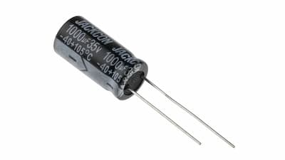
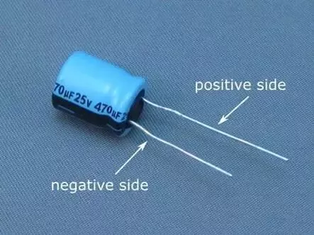
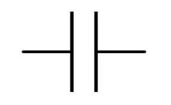
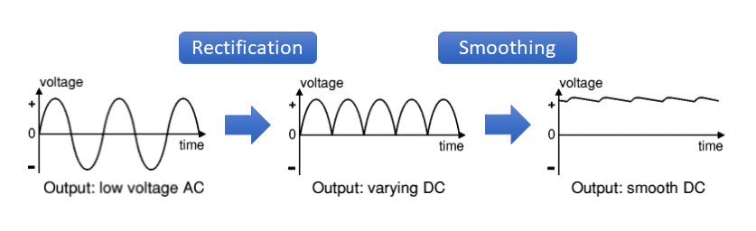
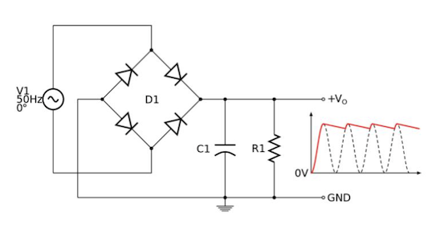
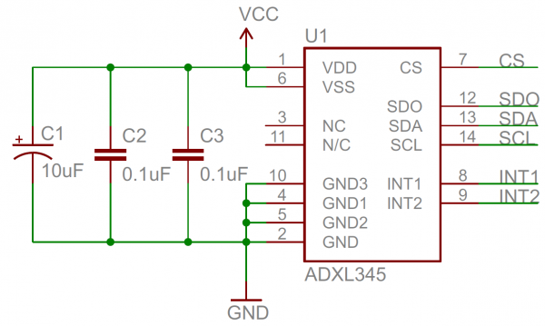

# Capacitor
A Capacitor is a passive component that has the ability to store the energy in the form of potential difference between its plates.

## Polarized capacitor
A polarized capacitor is a type of capacitor that has a specific polarity or direction in which it must be connected in a circuit. Electrolytic capacitors are polarized capacitors.

### Schematic symbol

## Non-Polarized capacitor
Non-polarized capacitors are capacitors that do not have a specific polarity; in other words, they can be connected to a circuit in either direction. Unlike polarized capacitors, non-polarized capacitors do not have a positive and a negative lead.

### Schematic symbol

## Smoothing capacitor
A smoothing capacitor, also known as a filter capacitor or reservoir capacitor, is a type of capacitor commonly used in electronic circuits, especially in power supply circuits. Its primary function is to reduce or eliminate the ripple voltage in a DC power supply.

In a rectifier circuit, AC voltage is converted to DC voltage. However, due to the nature of the rectification process, the resulting DC voltage may have some variations or ripples. A smoothing capacitor is introduced in the circuit to smooth out these ripples and produce a more stable DC voltage.

## Bypass capacitors
A bypass capacitor gets its name from bypassing AC noise in a DC signal. It can filter out noise to the degree of helping facilitate a clean DC signal. The DC signal in a transistor, for example, needs to be as pure as possible without AC ripple. However, power supplies that provide voltage to the circuit aren't always clean, so it's important to use a filtering device such as a bypass capacitor.

## Decoupling capacitors
The decoupling capacitor is mainly to remove the interference of high frequency such as RF signal, and the way of entering the interference is through electromagnetic radiation. 

