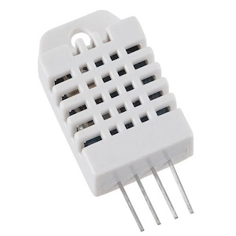
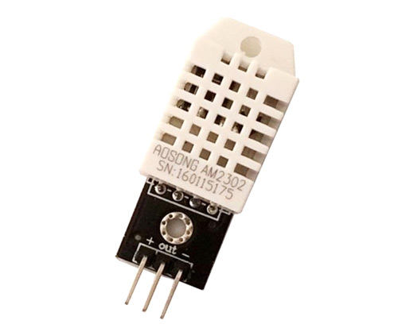

# DHT22 (AM2303) Humidity/Temperature sensor
DHT22 (AM2303) is humidity/temperature sensor. Inside the AM2303 sensor’s module, has an NTC thermistor and a humidity-sensing component on one side of the internal board. On the back side of the board, it is a small microcontroller that handles data acquisition, processing, and transmission over the 1-Wire digital protocol as specified in the datasheet of the AM2303 sensor.

- 0-100% humidity readings with 2-5% accuracy
- -40 to 80°C temperature readings ±0.5°C accuracy
- low cost

Datasheet [link](./assets/am2302-datasheet.pdf).

## Sensor vs Module
Difference between the sensor and module is that the module will have a filtering capacitor and pull-up resistor inbuilt, and for the sensor you have to use them externally if required.

## Pinout
