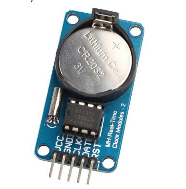
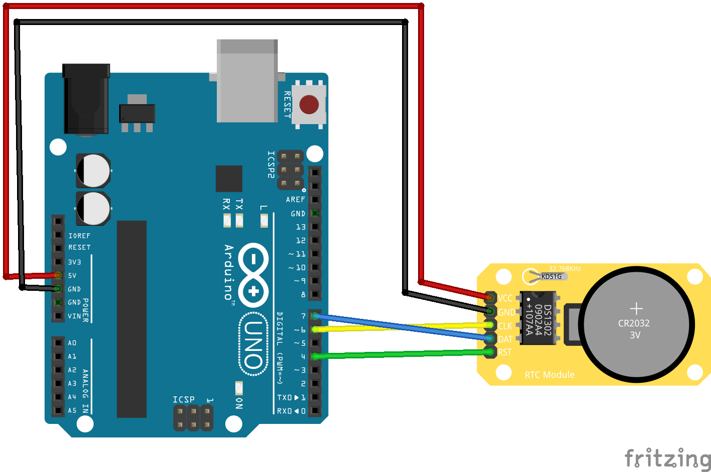

# DS1302

DS3102 - real-time clock (RTC) integrated circuit. Usually comes in RTC module board with Quartz Crystal and secondary battery supply holder `CR2025`.

Has next features:
- has additional `31` bytes ram;
- has protection bit;
- has burst mode;
- has halt mode;
- has calendar;
- has 12AM/PM or 24 hours modes;



Datasheet [link](./assets/ds1302.pdf)

## Module pins

| Pin number | Name     | Function                                           |
| ---------- | -------- | -------------------------------------------------- |
| 1          | VCC      | Primary battery source 5V                          |
| 2          | GND      | GND                                                |
| 3          | CLK      | Clock pin                                          |
| 4          | DAT      | Data pin                                           |
| 5          | RST (CE) | Reset (Must be HIGH for active mode / Active High) |

## Burst mode
For `RAM` in this mode, the `31` RAM registers can be consecutively read or written. Same for `Clock/Calendar`.

### Clock/Calendar

| Read | Write |
| ---- | ----- |
| 0xBF | 0xBE  |

### Ram

| Read | Write |
| ---- | ----- |
| 0xFF | 0xFE  |

## Commands

## Clock/Calendar
| Read | Write | BIT 7   | BIT 6      | BIT 5         | BIT 4      | BIT 3   | BIT 2    | BIT 1    | BIT 0    |
| ---- | ----- | ------- | ---------- | ------------- | ---------- | ------- | -------- | -------- | -------- |
| 0x81 | 0x80  | CH      | 10 seconds | 10 seconds    | 10 seconds | Seconds | Seconds  | Seconds  | Seconds  |
| 0x83 | 0x82  |         | 10 minutes | 10 minutes    | 10 minutes | Minutes | Minutes  | Minutes  | Minutes  |
| 0x85 | 0x84  | 12/(24) | 0          | 10 or (AM)/PM | Hours      | Hours   | Hours    | Hours    | Hours    |
| 0x87 | 0x86  | 0       | 0          | 10 date       | 10 date    | Date    | Date     | Date     | Date     |
| 0x89 | 0x88  | 0       | 0          | 0             | 10 month   | Month   | Month    | Month    | Month    |
| 0x8B | 0x8A  | 0       | 0          | 0             | 0          | 0       | Week day | Week day | Week day |
| 0x8D | 0x8C  | 10 year | 10 year    | 10 year       | 10 year    | Year    | Year     | Year     | Year     |
| 0x8F | 0x8E  | WP      | 0          | 0             | 0          | 0       | 0        | 0        | 0        |

`CH` - CLOCK HALT FLAG - When this bit is set to logic 1, the clock oscillator
is stopped and the DS1302 is placed into a low-power standby mode with a current drain of less than 100nA. When
this bit is written to logic 0, the clock will start

`WP` - Write Protect - When high, the write-protect bit
prevents a write operation to any other register. The initial power-on state is not defined. Therefore, the WP bit
should be cleared before attempting to write to the device

### Ram

| Op    | 1    | 2    | 3    | 4    | 5    | 6    | 7    | 8    | 9    | 10   | 11   |
| ----- | ---- | ---- | ---- | ---- | ---- | ---- | ---- | ---- | ---- | ---- | ---- |
| Read  | 0xC1 | 0xC3 | 0xC5 | 0xC7 | 0xC9 | 0xCB | 0xCD | 0xCF | 0xD1 | 0xD3 | 0xD5 |
| Write | 0xC0 | 0xC2 | 0xC4 | 0xC6 | 0xC8 | 0xCA | 0xCC | 0xCE | 0xD0 | 0xD2 | 0xD4 |


| Op    | 12   | 13   | 14   | 15   | 16   | 17   | 18   | 19   | 20   | 21   | 22   |
| ----- | ---- | ---- | ---- | ---- | ---- | ---- | ---- | ---- | ---- | ---- | ---- |
| Read  | 0xD7 | 0xD9 | 0xDB | 0xDD | 0xDF | 0xE1 | 0xE3 | 0xE5 | 0xE7 | 0xE9 | 0xEB |
| Write | 0xD6 | 0xD8 | 0xDA | 0xDC | 0xDE | 0xE0 | 0xE2 | 0xE4 | 0xE6 | 0xE8 | 0xEA |


| Op    | 23   | 24   | 25   | 26   | 27   | 28   | 29   | 30   | 31   |
| ----- | ---- | ---- | ---- | ---- | ---- | ---- | ---- | ---- | ---- |
| Read  | 0xED | 0xEF | 0xF1 | 0xF3 | 0xF5 | 0xF7 | 0xF9 | 0xFB | 0xFD |
| Write | 0xEC | 0xEE | 0xF0 | 0xF2 | 0xF4 | 0xF6 | 0xF8 | 0xFA | 0xFC |


## Code example



### Clock/Calendar
```c
#include "src/ds1302.h"
#include "src/uart.h"

#include <util/delay.h>
#include <stdio.h>
#include <stdlib.h>

int main(int argc, char *argv[]) {
  usart_init(9600);
  ds1302_init();

  char buffer[100];

  while (1) {
    _delay_ms(1000);
    uint8_t year = ds1302_read_year();
    uint8_t month = ds1302_read_month();
    uint8_t date = ds1302_read_date();
    uint8_t hour = ds1302_read_hour();
    uint8_t minutes = ds1302_read_minutes();
    uint8_t seconds = ds1302_read_seconds();

    snprintf(buffer, sizeof(buffer), "%d:%d:%2d %d/%d/20%d.\r\n", hour, minutes, seconds, date, month, year);
    usart_print_string(buffer);
  }
}
```

### Ram

```c
#include "src/ds1302.h"
#include "src/uart.h"
#include "stdio.h"

int main(int argc, char *argv[]) {
  usart_init(9600);
  ds1302_init();

  uint8_t data_to_write[31];

  for (uint8_t i = 0; i < 31; i++) {
    data_to_write[i] = (i + 1) * 2;
  }

  ds1302_ram_burst_write(data_to_write);

  char buffer[30];

  uint8_t ram_data[31];
  ds1302_ram_burst_read(ram_data);

  for (uint8_t i = 0; i < 31; i++) {
    snprintf(buffer, sizeof(buffer), "ram i=%d v=%d \r\n", i + 1, ram_data[i]);
    usart_print_string(buffer);
  }
}
```