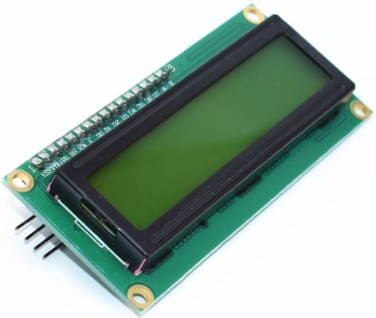
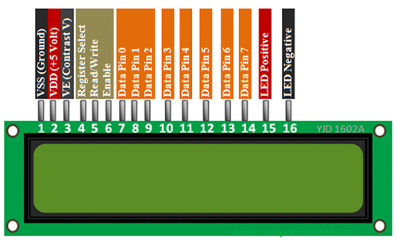
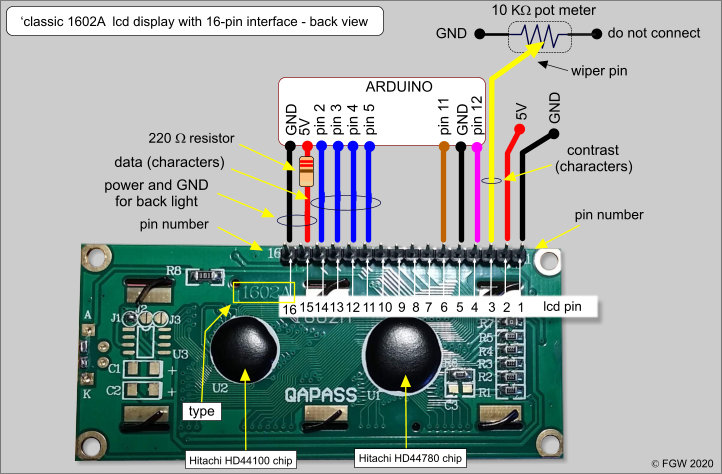
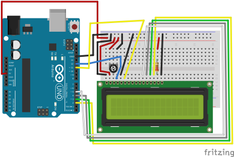

# LCD 1602
2 rows and 16 symbols

Data sheet [link](./assets/lcd1602.pdf)

## Pinout

| Pin number | Name      | Function                                                |
| ---------- | --------- | ------------------------------------------------------- |
| 1          | VSS (GND) | Ground                                                  |
| 2          | VDD (VCC) | Power supply (5v)                                       |
| 3          | Vo        | LCD Contrast                                            |
| 4          | RS        | Register Select, low sending command, high sending data |
| 5          | RW        | read/write data. Typically low (write)                  |
| 6          | E         | Enable display                                          |
| 7          | D0        | Data bus bit 0                                          |
| 8          | D1        | Data bus bit 1                                          |
| 9          | D2        | Data bus bit 2                                          |
| 10         | D3        | Data bus bit 3                                          |
| 11         | D4        | Data bus bit 4                                          |
| 12         | D5        | Data bus bit 5                                          |
| 13         | D6        | Data bus bit 6                                          |
| 14         | D7        | Data bus bit 7                                          |
| 15         | A         | Anode (Screen backlight)                                |
| 16         | K         | Cathode (Screen backlight)                              |

Connect `15th` pin with resistor `220` ohm

## HD44780
1602 display has `HD44100`. This driver additionally uses `HD44780`.

 
Data sheet [link](./assets/HD44780.pdf)

## Connection 

