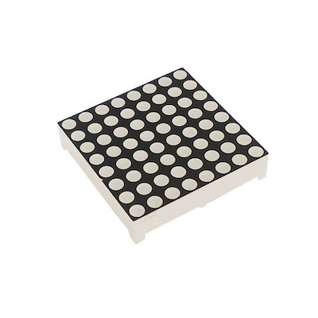
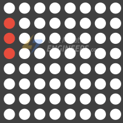
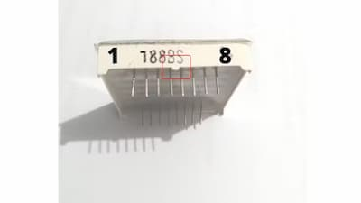
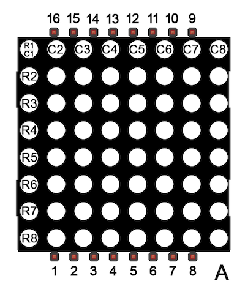
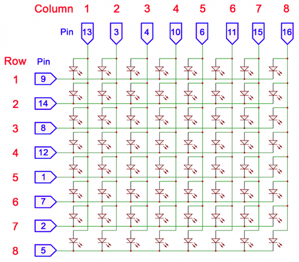
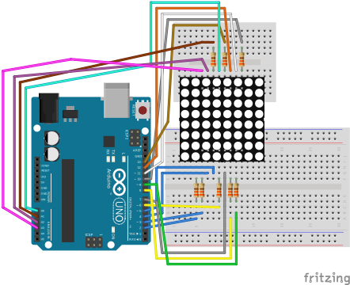

# Led Matrix
Materials used from [lastminuteengineers](https://lastminuteengineers.com/max7219-dot-matrix-arduino-tutorial/)

LED matrixes consist of an array of LEDs arranged in a grid. If this were not the case, an 8×8 dot matrix display would require 65 pins, one for each LED and one for a common anode or common cathode connector. By connecting rows and columns, only 16 pins are needed to control the entire matrix. This technique of controlling a large number of LEDs with fewer pins is referred to as Multiplexing.



## Multiplexing 
Each column is activated for a very short time, and at the same time, the LEDs on that column are lit by addressing the corresponding row. As a result, no more than eight LEDs are lit at the same time. The columns are switched so fast (hundreds or thousands of times per second) that the human eye perceives the display as fully lit.

In this technique, each column is activated for a very short time, and at the same time, the LEDs on that column are lit by addressing the corresponding row. As a result, no more than eight LEDs are lit at the same time. The columns are switched so fast (hundreds or thousands of times per second) that the human eye perceives the display as fully lit.



### Pinout

| Matrix pin | Row | Column |
| ---------- | --- | ------ |
| 1          | 5   | -      |
| 2          | 7   | -      |
| 3          | -   | 2      |
| 4          | -   | 3      |
| 5          | 8   | -      |
| 6          | -   | 5      |
| 7          | 6   | -      |
| 8          | 3   | -      |
| 9          | 1   | -      |
| 10         | -   | 4      |
| 11         | -   | 6      |
| 12         | 4   | -      |
| 13         | -   | 1      |
| 14         | 2   | -      |
| 15         | -   | 7      |
| 16         | -   | 8      |

How to detect first pin:







## 1088AYG
This one has display with a total of 64 LEDs in 8 rows and 8 columns. Green.

Row cathode (-), Column anode (+)

## Connection



Code example with multiplexing
```c
#include <avr/io.h>
#include <util/delay.h>

const uint8_t row1 = PB2;
const uint8_t row2 = PC1;
const uint8_t row3 = PB1;
const uint8_t row4 = PB5;
const uint8_t row5 = PD2;
const uint8_t row6 = PB0;
const uint8_t row7 = PD3;
const uint8_t row8 = PD6;

const uint8_t col1 = PC0;
const uint8_t col2 = PD4;
const uint8_t col3 = PD5;
const uint8_t col4 = PB3;
const uint8_t col5 = PD7;
const uint8_t col6 = PB4;
const uint8_t col7 = PC2;
const uint8_t col8 = PC3;


void setup(void);
void lightOne(uint8_t light[8][8]);

void main(void) {
  setup();

  uint8_t light[8][8] = {
    {0, 0, 0, 0, 0 ,0 ,0 ,0},
    {0, 1, 1, 0, 0 ,1 ,1 ,0},
    {1, 1, 1, 1, 1 ,1 ,1 ,1},
    {1, 1, 1, 1, 1 ,1 ,1 ,1},
    {0, 1, 1, 1, 1 ,1 ,1 ,0},
    {0, 0, 1, 1, 1 ,1 ,0 ,0},
    {0, 0, 0, 1, 1 ,1 ,0 ,0},
    {0, 0, 0, 0, 1 ,0 ,0 ,0}
  };

  while (1) {
    lightOne(light);
  }
}

void setup(void) {
  DDRD |= _BV(row5) | _BV(row7) | _BV(row8) | _BV(col2) | _BV(col3) | _BV(col5);
  DDRB |= _BV(row1) | _BV(row3) | _BV(row4) | _BV(row6) | _BV(col4) | _BV(col6);
  DDRC |= _BV(row2) | _BV(col1) | _BV(col7) | _BV(col8);
}

void lightOne(uint8_t light[8][8]) {
  uint8_t rows[8] = {row1, row2, row3, row4, row5, row6, row7, row8};
  volatile uint8_t* rowsPorts[8] = {&PORTB, &PORTC, &PORTB, &PORTB, &PORTD, &PORTB, &PORTD, &PORTD};

  uint8_t cols[8] = {col1, col2, col3, col4, col5, col6, col7, col8};
  volatile uint8_t* colsPorts[8] = {&PORTC, &PORTD, &PORTD, &PORTB, &PORTD, &PORTB, &PORTC, &PORTC};

  for (int col = 0; col < 8; col++) {
    *colsPorts[col] |= _BV(cols[col]);
  
    for (int row = 0; row < 8; row++) {
      if (light[row][col]) {
        *rowsPorts[row] &= ~_BV(rows[row]);
      } else {
        *rowsPorts[row] |= _BV(rows[row]);
      }
    }

    _delay_ms(2);
    *colsPorts[col] &= ~_BV(cols[col]);
  }
}
```