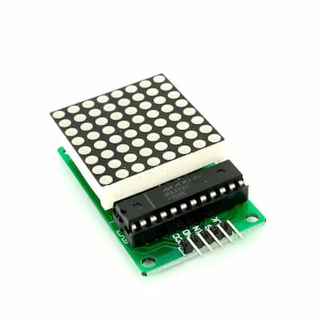

# MAX7219
The MAX7219 is a serially interfaced LED display driver that allows to control individual LED segments or 7-segment displays.


[Datasheet link](./assets/max7219-max7221.pdf)

## Pins

| Pin number | Name      | Function                           |
| ---------- | --------- | ---------------------------------- |
| 1          | DIN       | Data input                         |
| 2          | DIG 0     | Column 1                           |
| 3          | DIG 4     | Column 5                           |
| 4          | GND       | Ground                             |
| 5          | DIG 6     | Column 7                           |
| 6          | DIG 2     | Column 3                           |
| 7          | DIG 3     | Column 4                           |
| 8          | DIG 7     | Column 8                           |
| 9          | GND       | Ground                             |
| 10         | DIG 5     | Column 6                           |
| 11         | DIG 1     | Column 2                           |
| 12         | LOAD (CS) | Chis select pin SPI                |
| 13         | CLK       | Clock pin SPI                      |
| 14         | SEG A     | Row 2                              |
| 15         | SEG F     | Row 7                              |
| 16         | SEG B     | Row 3                              |
| 17         | SEG G     | Row 8                              |
| 18         | ISET      | Sets the maximum  supplied current |
| 19         | V+        | Positive supply voltage            |
| 20         | SEG C     | Row 4                              |
| 21         | SEG E     | Row 6                              |
| 22         | SEG D     | Row 5                              |
| 23         | SEG DP    | Row 1                              |
| 24         | DOUT      | Data output                        |


## API

Serial Data format 16 bits

| D15 | D14 | D13 | D13 | D11  | D10  | D9   | D8   | D7   | D6   | D5   | D4   | D3   | D2   | D1   | D0   |
| --- | --- | --- | --- | ---- | ---- | ---- | ---- | ---- | ---- | ---- | ---- | ---- | ---- | ---- | ---- |
| x   | x   | x   | x   | Addr | Addr | Addr | Addr | Data | Data | Data | Data | Data | Data | Data | Data |


Addresses
| Name           | Description                                                  | Address |
| -------------- | ------------------------------------------------------------ | ------- |
| Dig 1          | Control digit 1 (or row 1 in LED matrix)                     | 0x01    |
| Dig 2          | Control digit 2 (or row 2 in LED matrix)                     | 0x02    |
| Dig 3          | Control digit 3 (or row 3 in LED matrix)                     | 0x03    |
| Dig 4          | Control digit 4 (or row 4 in LED matrix)                     | 0x04    |
| Dig 5          | Control digit 5 (or row 5 in LED matrix)                     | 0x05    |
| Dig 6          | Control digit 6 (or row 6 in LED matrix)                     | 0x06    |
| Dig 7          | Control digit 7 (or row 7 in LED matrix)                     | 0x07    |
| Dig 8          | Control digit 8 (or row 8 in LED matrix)                     | 0x08    |
| Decode mode    | Setup decode mode. For LED matrix use 0 for no decode        | 0x09    |
| Intensity mode | Setup intensity                                              | 0x0a    |
| Scan limit     | Setup how many digits (or rows in LED matrix) should be used | 0x0b    |
| Shutdown       | Setup in normal (operation) mode - 1 or shutdown - 0         | 0x0c    |
| Display Test   | Will enable all rows and cols                                | 0x0f    |

## Connection
Recommended to connect with external power supply and with decoupling capacitors.

## Led Matrix

### Connection with LED matrix


### Module with LED matrix
Module already has built-in debouncing capacitors and resistor and already connected to led matrix



### Code example
```c
#include <avr/io.h>
#include <util/delay.h>

#define MAX7219_DECODE_MODE_REG 0x09
#define MAX7219_INTENSITY_REG 0x0a
#define MAX7219_SCAN_LIMIT_REG 0x0b
#define MAX7219_SHUTDOWN_REG 0x0c
#define MAX7219_DISPLAY_TEST_REG 0x0f

const uint8_t dataPin = PB3;
const uint8_t sckPin = PB5;
const uint8_t latchPin = PB2;

void setup_spi(void);
void spi_transmit(uint8_t data);
void send_to_max7219(uint8_t addr, uint8_t data);
void setup_max7219_led_matrix(void);

uint8_t Cat[8] = {
  0b10001000,
  0b11111000,
  0b10101000,
  0b01110001,
  0b00100001,
  0b01111001,
  0b01111101,
  0b10111110
};

void main(void) {
  setup_spi();
  setup_max7219_led_matrix();

  for (int i = 0; i < 8; i++) {
    send_to_max7219(i + 1, Cat[i]);
  }
}

void setup_spi(void) {
  DDRB |= _BV(dataPin) | _BV(sckPin) | _BV(latchPin);

  SPCR = (1 << SPE) | (1 << MSTR) | (1 << SPR0); 
}

void spi_transmit(uint8_t data) {
  SPDR = data;
  while(bit_is_clear(SPSR, SPIF));
}

void send_to_max7219(uint8_t addr, uint8_t data) {
  spi_transmit(addr);
  spi_transmit(data);

  PORTB |= _BV(latchPin);
  _delay_us(1);
  PORTB &= ~_BV(latchPin);
  _delay_us(1);
}

void setup_max7219_led_matrix(void) {
  send_to_max7219(MAX7219_DECODE_MODE_REG, 0);
  send_to_max7219(MAX7219_SCAN_LIMIT_REG, 0xf);
  send_to_max7219(MAX7219_INTENSITY_REG, 0);
  send_to_max7219(MAX7219_DISPLAY_TEST_REG, 0);
  send_to_max7219(MAX7219_SHUTDOWN_REG, 1);
}
```