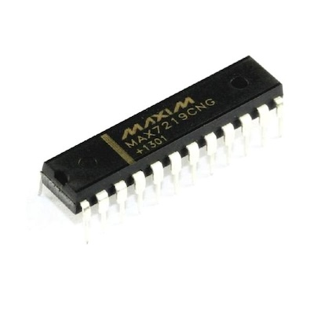

# MAX7219
The MAX7219 is a serially interfaced LED display driver that allows to control individual LED segments or 7-segment displays.

## Pins

| Pin number | Name      | Function                           |
| ---------- | --------- | ---------------------------------- |
| 1          | DIN       | Data input                         |
| 2          | DIG 0     | Column 1                           |
| 3          | DIG 4     | Column 5                           |
| 4          | GND       | Ground                             |
| 5          | DIG 6     | Column 7                           |
| 6          | DIG 2     | Column 3                           |
| 7          | DIG 3     | Column 4                           |
| 8          | DIG 7     | Column 8                           |
| 9          | GND       | Ground                             |
| 10         | DIG 5     | Column 6                           |
| 11         | DIG 1     | Column 2                           |
| 12         | LOAD (CS) | Chis select pin SPI                |
| 13         | CLK       | Clock pin SPI                      |
| 14         | SEG A     | Row 2                              |
| 15         | SEG F     | Row 7                              |
| 16         | SEG B     | Row 3                              |
| 17         | SEG G     | Row 8                              |
| 18         | ISET      | Sets the maximum  supplied current |
| 19         | V+        | Positive supply voltage            |
| 20         | SEG C     | Row 4                              |
| 21         | SEG E     | Row 6                              |
| 22         | SEG D     | Row 5                              |
| 23         | SEG DP    | Row 1                              |
| 24         | DOUT      | Data output                        |

## Brightness
The MAX7219 LED display driver includes a feature for controlling the brightness of the connected LED displays.
It can be configured by hardware or software.

### Hardware
The MAX7219 includes a resistor (`RSet`) for adjusting the brightness at the hardware level

TBD

### Software
TBD

## API

Serial Data format 16 bits

| D15 | D14 | D13 | D13 | D11  | D10  | D9   | D8   | D7   | D6   | D5   | D4   | D3   | D2   | D1   | D0   |
| --- | --- | --- | --- | ---- | ---- | ---- | ---- | ---- | ---- | ---- | ---- | ---- | ---- | ---- | ---- |
| x   | x   | x   | x   | Addr | Addr | Addr | Addr | Data | Data | Data | Data | Data | Data | Data | Data |

## Connection with LED matrix

