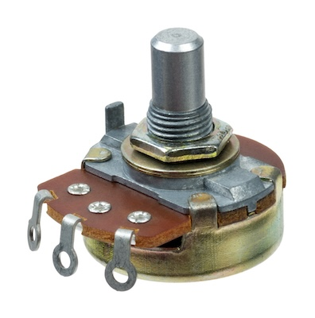
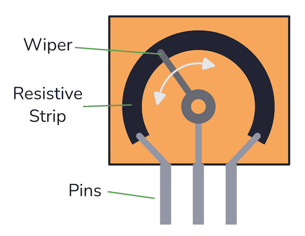
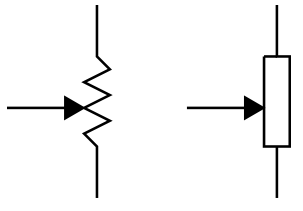
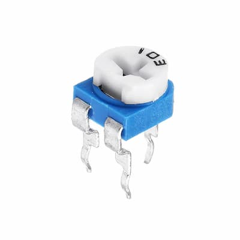
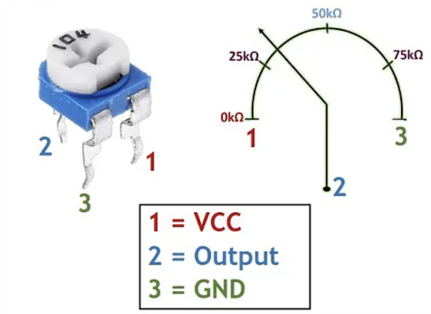
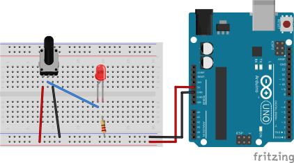
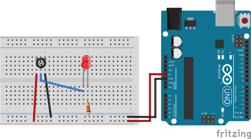

# Potentiometer (Pot)
A potentiometer, is a three-terminal variable resistor with a sliding or rotating contact that forms an adjustable voltage divider. It is commonly used in electrical and electronic circuits for various purposes, such as controlling the volume on audio equipment, adjusting the brightness of a display, or setting the speed of a motor.

## How it works
A potentiometer works based on the principle of varying resistance to control the flow of electric current. It consists of a resistive element, usually a strip of resistive material, and a movable contact that can slide or rotate along the resistor. The three terminals of the potentiometer allow it to be integrated into a circuit in a way that enables manual adjustment of the output voltage.

**Potentiometer has no polarity**

## Schematic symbol

## Trimming Potentiometer
A trimming potentiometer, also known as a trimmer potentiometer or trim pot, is a specialized type of potentiometer designed for fine adjustments or calibration in electronic circuits. It's often used during the manufacturing or tuning process to set precise values or to compensate for variations in components.

Trimming potentiometers are designed for precise adjustments. They usually have a screw or small knob that can be turned with a screwdriver for fine-tuning.

Trimmers are often compact in size compared to regular potentiometers. Their small form factor makes them suitable for applications where space is limited.

## Models
`B1K` - has 1 kOm resistance
`103` - trimming potentiometer has 10 kOm resistance

## Circuit

