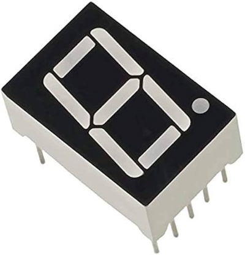
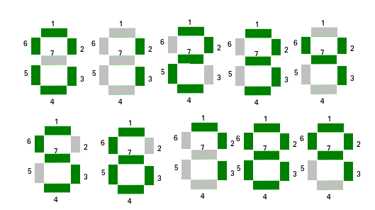
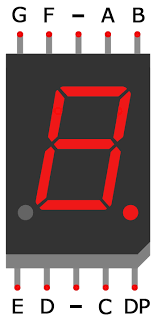
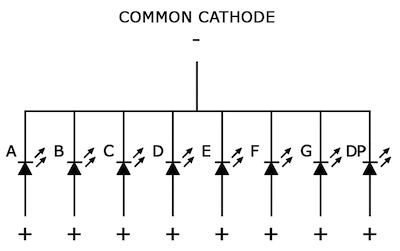
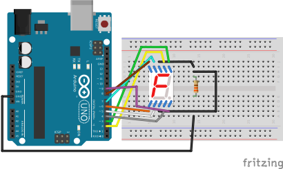
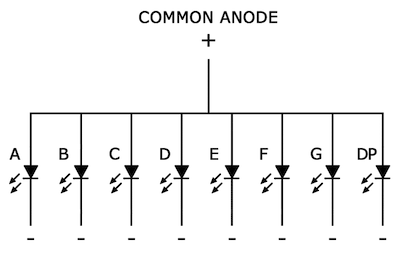
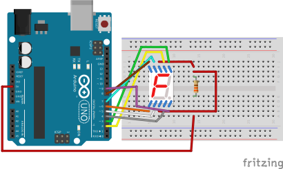

# Seven Segment Display
A seven-segment display is a form of electronic display device used to represent decimal numbers. It consists of seven LEDs (Light Emitting Diodes) arranged in a specific pattern to form the digit segments. Each segment is labeled with a letter (A to G) and represents one part of the digit. The arrangement of segments allows the display of numerals 0 through 9.



## Segments
```
   A
 F   B
   G
 E   C
   D
```





## Pins
`DP` - dot



## Common Anode/Cathode
Common cathode (CC) and common anode (CA). The difference between the two displays is the common cathode has all the cathodes of the 7-segments connected directly together and the common anode has all the anodes of the 7-segments connected together.

### Common cathode
`5161AS` - Common Cathode (-)





Code example
```c
#include <avr/io.h>

const uint8_t aPin = PD2;
const uint8_t bPin = PD3;
const uint8_t cPin = PD4;
const uint8_t dPin = PD5;
const uint8_t ePin = PD6;
const uint8_t fPin = PD7;
const uint8_t gPin = PB0;
const uint8_t dpPin = PB0;

const uint8_t numbers[] = {
  0b00111111, // 0
  0b00000110, // 1
  0b01011011, // 2
  0b01001111, // 3
  0b01100110, // 4
  0b01101101, // 5
  0b01111101, // 6
  0b00000111, // 7
  0b01111111, // 8
  0b01101111  // 9
};

void setupPins(void);
void drawDisplay(uint8_t data);

int main(void) {
  setupPins();
  drawDisplay(numbers[9]);
}

void setupPins(void) {
  DDRD |= _BV(aPin) | _BV(bPin) | _BV(cPin) | _BV(dPin) | _BV(ePin) | _BV(fPin);
  DDRB |= _BV(gPin) | _BV(dpPin);
}

void drawDisplay(uint8_t data) {
  uint8_t pins[] = {aPin, bPin, cPin, dPin, ePin, fPin, gPin};
  for (int i = 0; i < 7; i++) {
    volatile uint8_t *port = i < 6 ? &PORTD : &PORTB;

    if (bit_is_set(data, i)) {
      *port |= _BV(pins[i]);
    } else {
      *port &= ~_BV(pins[i]);
    }
  }
}
```

### Common Anode
`5161BS` - Common Anode (+)





Code example
```c
#include <avr/io.h>

const uint8_t aPin = PD2;
const uint8_t bPin = PD3;
const uint8_t cPin = PD4;
const uint8_t dPin = PD5;
const uint8_t ePin = PD6;
const uint8_t fPin = PD7;
const uint8_t gPin = PB0;
const uint8_t dpPin = PB0;

const uint8_t numbers[] = {
  0b00111111, // 0
  0b00000110, // 1
  0b01011011, // 2
  0b01001111, // 3
  0b01100110, // 4
  0b01101101, // 5
  0b01111101, // 6
  0b00000111, // 7
  0b01111111, // 8
  0b01101111  // 9
};

void setupPins(void);
void drawDisplay(uint8_t data);

int main(void) {
  setupPins();
  drawDisplay(numbers[5]);
}

void setupPins(void) {
  DDRD |= _BV(aPin) | _BV(bPin) | _BV(cPin) | _BV(dPin) | _BV(ePin) | _BV(fPin);
  DDRB |= _BV(gPin) | _BV(dpPin);
}

void drawDisplay(uint8_t data) {
  uint8_t pins[] = {aPin, bPin, cPin, dPin, ePin, fPin, gPin};
  for (int i = 0; i < 7; i++) {
    volatile uint8_t *port = i < 6 ? &PORTD : &PORTB;

    if (bit_is_clear(data, i)) {
      *port |= _BV(pins[i]);
    } else {
      *port &= ~_BV(pins[i]);
    }
  }
}
```