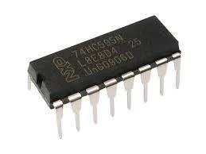
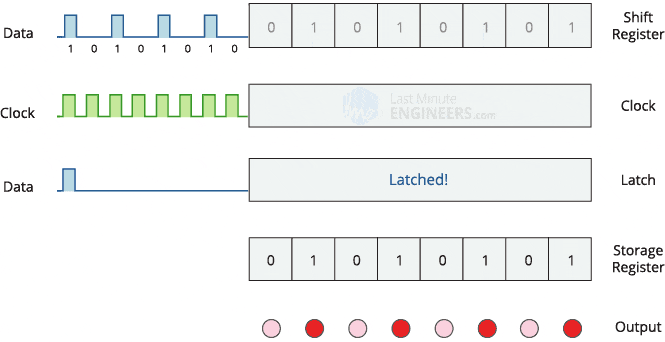
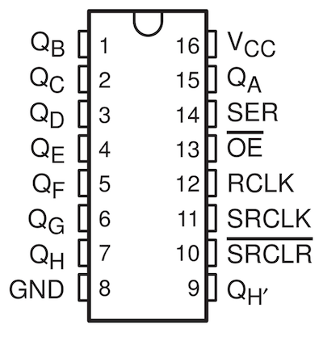
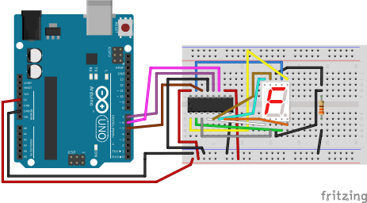

# Shift register
A shift register is a digital circuit that can shift its data through a chain of flip-flops, usually in a serial manner. It's a fundamental building block in digital electronics and is commonly used for tasks such as parallel-to-serial conversion, serial-to-parallel conversion, data storage, and data transfer.

## Types
- **Serial-In, Serial-Out (SISO)**. In a basic shift register configuration, data is shifted in serially through one input (Serial In) and shifted out serially through another output (Serial Out). The data moves through the flip-flops one bit at a time.
- **Parallel-In, Serial-Out (PISO)**. Some shift registers allow you to load parallel data into the register and then shift it out serially. This is useful for tasks like converting parallel data to serial for transmission over a single wire.
- **Serial-In, Parallel-Out (SIPO)**. Conversely, you can shift in data serially and read it out in parallel. This is commonly used for tasks like reading a series of sensors with a single data line.
- **Parallel-In, Parallel-Out (PIPO)**. There are also shift registers that allow parallel loading and unloading of data, where all the bits are shifted simultaneously.


## 74HC595N
8-bit serial-in, serial or parallel-out shift register with output latches. Widely used to expand the number of output pins of a microcontroller by allowing serial communication to control multiple digital outputs.



Datasheet [link](./assets/74HC595D_datasheet.pdf)

### How it works


### Pins
Don't leave empty pins! All pins should be used properly

| Pin number | Name        | Function                               |
| ---------- | ----------- | -------------------------------------- |
| 1          | Qb, Q1      | Data out pin 2                         |
| 2          | Qc, Q2      | Data out pin 3                         |
| 3          | Qd, Q3      | Data out pin 4                         |
| 4          | Qe, Q4      | Data out pin 5                         |
| 5          | Qf, Q5      | Data out pin 6                         |
| 6          | Qg, Q6      | Data out pin 7                         |
| 7          | Qh, Q7      | Data out pin 8                         |
| 8          | Gnd         | Ground                                 |
| 9          | Qh\`, Q8\`  | Serial Out (For daisy chaining)        |
| 10         | !MR, !SRCLR | Master Reclear, active low             |
| 11         | SHCP, SRCLK | Shift register clock pin               |
| 12         | STCP, RCLK  | Storage register clock pin (latch pin) |
| 13         | !OE         | Output enable, active low              |
| 14         | DS, SER     | Serial data input                      |
| 15         | Qa, Q0      | Data out pin 1                         |
| 16         | Vcc         | Positive supply voltage                |



### SPI Software Implementation Demo




Program
```c
#include <avr/io.h>
#include <util/delay.h>

const uint8_t dataPin = PD5; // PICO, MOSI
const uint8_t sckPin = PD6; // Serial clock
const uint8_t latchPin = PD7; // SS

const uint8_t numbers[] = {
  0b00111111, // 0
  0b00000110, // 1
  0b01011011, // 2
  0b01001111, // 3
  0b01100110, // 4
  0b01101101, // 5
  0b01111101, // 6
  0b00000111, // 7
  0b01111111, // 8
  0b01101111  // 9
};

void setupPins(void);
void drawDisplay(uint8_t data);
void shiftOutM(int val);
void shiftOut(uint8_t data);

int main(void) {
  setupPins();
  drawDisplay(numbers[4]);
}

void setupPins(void) {
  DDRD |= _BV(dataPin) | _BV(sckPin) | _BV(latchPin);
}

void drawDisplay(uint8_t data) {
  shiftOut(data); // 7 segment with common anode, LSB

  PORTD |= _BV(latchPin);
  _delay_us(1);
  PORTD &= ~_BV(latchPin);
  _delay_us(1);
}

void shiftOut(uint8_t data) {
  for (int8_t i = 7; i >= 0; i--) {
    if (bit_is_set(data, i)) {
      PORTD |= _BV(dataPin);
    } else {
      PORTD &= ~_BV(dataPin);
    }

    PORTD |= _BV(sckPin);
    _delay_us(1);
    PORTD &= ~_BV(sckPin);
    _delay_us(1);
  }
}
```