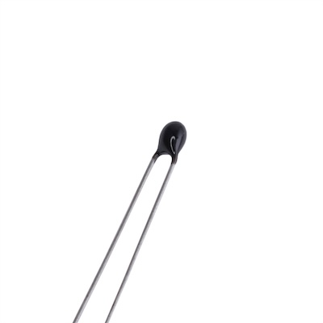

# Thermistor
Type of resistor whose resistance changes with temperature changes.

## Negative Temperature Coefficient (NTC)
Resistance decreases with an increase in temperature.

## Positive Temperature Coefficient (PTC)
Resistance increases with an increase in temperature.

## Usage
In order to measure value of thermistor, value of analogue pin should me measured.
