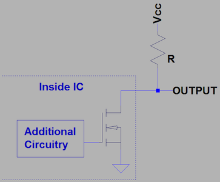

# General

## Serial Port
When flashing firmware, need to specify serial port on which micro controller is connected:
- Windows - `COM3`;
- Linux - `/dev/ttyUSB0`;
- MacOS - `/dev/tty.usbmodem1421` or `/dev/tty.usbserial-2110`. On MacOs can be found with `ls /dev/tty.usb*`;

### USB UART Driver
- `CP210x` USB to UART Bridge VCP Drivers from Silabs [link](https://www.silabs.com/developers/usb-to-uart-bridge-vcp-drivers?tab=downloads#software). For example `ESP32` has it.
- `CH340` USB to UART drivers for macos [link](https://github.com/adrianmihalko/ch340g-ch34g-ch34x-mac-os-x-driver). For example `Arduino nano` has it.

## Baud rate 
Baud rate - at which speed firmware will be flashed. Different micro controllers has different baud rates. 
- `ATMEGA328P` - 115200;
- `NodeMCU LoLin` - 9600;

## MCU
Short for microcontroller

## SoC
System-on-a-chip - integrated circuit that integrates most or all components of a computer or other electronic system.

## Bit numbering
LSB - least significant bit.

MSB - most significant bit.

## DIP
Dual In-line Package is an electronic component package with a rectangular housing and two parallel rows of electrical connecting pins.

### Pin numbering
Pin numbering is counter-clockwise. Notch in the package is at the top.

## Open drain
It is very common in integrated circuits for output pins to be open drain. A datasheet for an IC will either state this for an output pin or show a functional circuit diagram with the output pin being internally connected to the otherwise `open drain`.

Open drain outputs require a pull-up resistor for the output to be able to properly `output high`. The pull-up resistor is connected between the output pin and the output voltage that is desired for a high state.

Without a pull-up resistor, the signal line would be left floating and could easily pick up stray electromagnetic interference, resulting in an undefined voltage level.

If one of the connected devices pull down (sets pin in low level state) - `Vcc` goes to this pin and other pins will have logical low level on pins. High is idle state and low is active state.

Used in `I2C` protocol.

