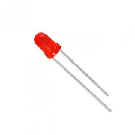
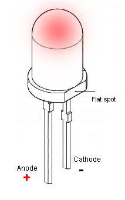
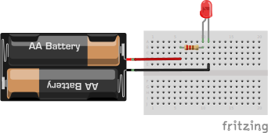
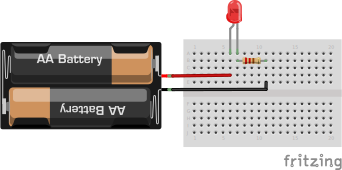
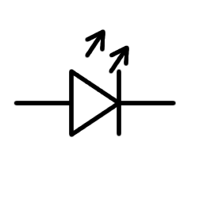

# LED
LED - light emitting diode

## Polarity
Has polarity, which means can be connected in one way. Connecting in wrong way will not emit light, will heat diode and potentially will damage LED. LED should be connected positive to anode and negative to cathode.

Anode on LED can be found by longer leg, and cathode can be found on flat side.

## Ballast resistor
The ballast resistor is used to limit the current through the LED and to prevent excess current that can burn out the LED. If the voltage source is equal to the voltage drop of the LED, no resistor is required.

Resistor should be connected in series, doesn't matter if before anode or after cathode.

In Arduino (where 5v voltage 25 mA current) and typical LED (1.8v) perfect resistor will be 220 Om.

Online resistor calculator [link](https://www.digikey.com/en/resources/conversion-calculators/conversion-calculator-led-series-resistor)

 ## Schematic symbol

 