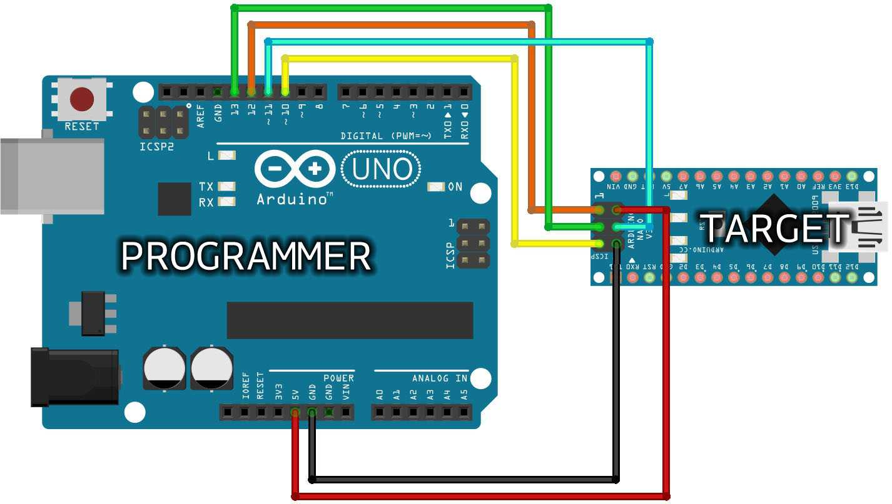

# Bootloader
A bootloader is a small piece of software that runs on a microcontroller (such as the one used in Arduino boards) and is responsible for loading the main application code into the microcontroller's flash memory. The main purpose of a bootloader is to simplify the process of programming the microcontroller, making it easier to upload new firmware or sketches without requiring specialized hardware programmers.

- When you power on or reset the microcontroller, the bootloader is the first code that runs.
- The bootloader is designed to communicate with a computer over a specific communication protocol, often using USB, UART (serial), or other interfaces.
- The presence of a bootloader simplifies the process of updating or loading new code onto a microcontroller. It eliminates the need for external programmers and allows for programming over standard communication interfaces.

## Update bootloader
Sometimes it's useful to flash bootloader (for example with chinese nano copy).

Tutorial [link](https://support.arduino.cc/hc/en-us/articles/4841602539164-Burn-the-bootloader-on-UNO-Mega-and-classic-Nano-using-another-Arduino)

### ICSP
In-Circuit Serial Programming (ICSP) is a method used to program microcontrollers in-circuit, i.e., while they are already mounted on a circuit board. Usually it has 2x3 pins header: three of the SPI pins (MISO, MOSI, SCK), power, ground, and reset.

Uno ICSP pins:
