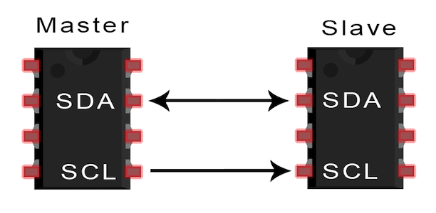

# I2C
Inter-Integrated Circuit - I2C - is a synchronous, multi-master, multi-slave, packet-switched, single-ended, serial communication bus commonly used in embedded systems, microcontrollers, and various electronic components.

Perfect video which explains I2C protocol [link](https://www.youtube.com/watch?v=CAvawEcxoPU)

SDA - Serial data
SCL - Serial clock

## Frame
MSB address and MSB data

ACK - Acknowledgment
NACK - Negative Acknowledgment