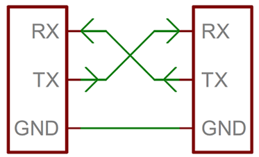

# UART
Universal Asynchronous Receiver/Transmitter - UART - serial communication in embedded systems and microcontrollers.

Perfect video which explains UART protocol [link](https://www.youtube.com/watch?v=sTHckUyxwp8).
Can be simplex, half-duplex and full-duplex.



RX - receive
TX - transmit

## Frame
Idle state is high. If it's not high, it means something not working.


## Baud rate
Baud rate is a term that originated from telegraphy and early telecommunications and is often used in the context of serial communication. It refers to the number of signal or symbol changes that occur per second. In simpler terms, baud rate represents the rate at which information is transmitted over a communication channel.

Typical options:
- `9600`
- `19200`
- `57600`
- `115200`

## USART
Universal Synchronous/Asynchronous Receiver/Transmitter - UART.
USART can be used in both asynchronous and synchronous modes. In synchronous mode, it uses a clock signal to synchronize data transfer, while in asynchronous mode, it behaves like a UART.

USART generally supports a higher data transfer rate compared to UART. While UART can typically transfer data at up to 115,200 bits per second, USART can support much higher data rates, depending on the specific implementation.

USART requires additional hardware compared to UART to support synchronous communication, such as a clock generator.

## Connect to serial

### VSCode serial monitor extension
[link](https://marketplace.visualstudio.com/items?itemName=ms-vscode.vscode-serial-monitor)

### Using screen tool
- `$ ls /dev/cu.*` - find device;
- `$ screen -ls` - list all sessions;
- `$ screen /dev/cu.usbserial-XXXX 9600` - attach session to device, (`115200` for esp32);
- `CTRL+A → CTRL+K` - stop session;


## USART
Code example

```c
#include <avr/io.h>

#ifndef F_CPU
#define F_CPU 16000000
#endif

void usart_init(uint32_t baud);
void usart_put_char(uint8_t data);
void usart_print_string(const char *str);

int main(void) {
  usart_init(9600);
  usart_print_string("Hello from USART!!\r\n");

  while (1);
}

void usart_init(uint32_t baud) {
  UBRR0H = (uint8_t)((F_CPU / (16 * baud) - 1) >> 8);
  UBRR0L = (uint8_t)(F_CPU / (16 * baud) - 1);
  UCSR0A = 0;

  UCSR0B |= (1 << RXEN0) | (1 << TXEN0);
  UCSR0C |= (1 << UCSZ01) | (1 << UCSZ00);
}

void usart_put_char(uint8_t data) {
  while (!(UCSR0A & (1 << UDRE0)));

  UDR0 = data;
}

void usart_print_string(const char *str) {
  while (*str) {
    usart_put_char(*str++);
  }
}
```