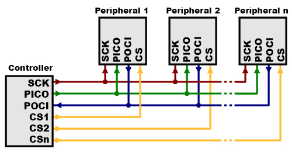
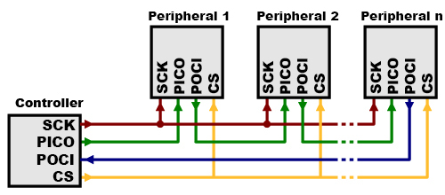

# SPI
The Serial Peripheral Interface (SPI) is a synchronous serial communication protocol used to enable communication between microcontrollers and peripheral devices. It involves a control-peripheral (or old master-slave) architecture, where one device (the controller/master) controls communication and timing while interacting with one or multiple peripheral devices (slaves).

Perfect video which explains SPI protocol [link](https://www.youtube.com/watch?v=0nVNwozXsIc)

## Communication lines
SPI typically uses four lines for communication:

- `POCI` (Peripheral Out Controller In) or `MISO` (Master In Slave Out): Carries data from the peripheral (slave) to the controller (master).
- `PICO` (Peripheral In Controller Out) `MOSI` (Master Out Slave In): Transmits data from the peripheral (master) to the controller (slave).
- `SCK` (Serial Clock): Provides the clock signal that synchronizes data transmission.
- `SS/CS` (Slave Select/Chip Select): Indicates which peripheral/slave device is being addressed for communication.

## Multiple Peripherals
There are two ways of connecting multiple peripherals to an SPI bus: parallel and daisy chaining.

### Parallel 
In this connection, each peripheral will require separate connection.

### Daisy chaining
Practice of connecting multiple devices in series, where the output of one device is connected to the input of the next device and so on, creating a chain-like configuration.

## Implementation

### Software

### Hardware