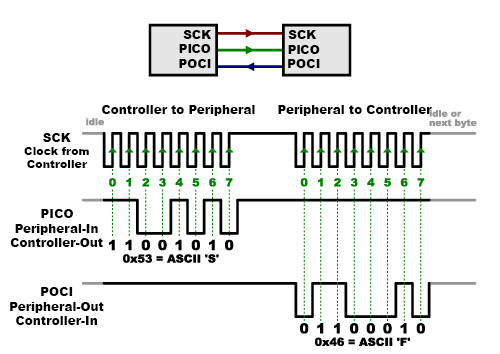

# SPI
The Serial Peripheral Interface (SPI) is a synchronous serial communication protocol used to enable communication between microcontrollers and peripheral devices. It involves a control-peripheral (or old master-slave) architecture, where one device (the controller/master) controls communication and timing while interacting with one or multiple peripheral devices (slaves).

Perfect video which explains SPI protocol [link](https://www.youtube.com/watch?v=0nVNwozXsIc)



## Communication lines
SPI typically uses four lines for communication:

- `POCI` (Peripheral Out Controller In) or `MISO` (Master In Slave Out): Carries data from the peripheral (slave) to the controller (master).
- `PICO` (Peripheral In Controller Out) `MOSI` (Master Out Slave In): Transmits data from the peripheral (master) to the controller (slave).
- `SCK` (Serial Clock): Provides the clock signal that synchronizes data transmission.
- `SS/CS` (Slave Select/Chip Select): Indicates which peripheral/slave device is being addressed for communication.

## Multiple Peripherals
There are two ways of connecting multiple peripherals to an SPI bus: parallel and daisy chaining.

### Parallel 
In this connection, each peripheral will require separate connection.


### Daisy chaining
Practice of connecting multiple devices in series, where the output of one device is connected to the input of the next device and so on, creating a chain-like configuration.


## Implementation

### Software
Using 74hc595 and 7 segment display:

Program
```c
#include <avr/io.h>
#include <util/delay.h>

const uint8_t dataPin = PD5; // PICO, MOSI
const uint8_t sckPin = PD6; // Serial clock
const uint8_t latchPin = PD7; // SS

const uint8_t numbers[] = {
  0b00111111, // 0
  0b00000110, // 1
  0b01011011, // 2
  0b01001111, // 3
  0b01100110, // 4
  0b01101101, // 5
  0b01111101, // 6
  0b00000111, // 7
  0b01111111, // 8
  0b01101111  // 9
};

void setupPins(void);
void drawDisplay(uint8_t data);
void shiftOutM(int val);
void shiftOut(uint8_t data);

int main(void) {
  setupPins();
  drawDisplay(numbers[4]);
}

void setupPins(void) {
  DDRD |= _BV(dataPin) | _BV(sckPin) | _BV(latchPin);
}

void drawDisplay(uint8_t data) {
  shiftOut(data); // 7 segment with common anode, LSB

  PORTD |= _BV(latchPin);
  _delay_us(1);
  PORTD &= ~_BV(latchPin);
  _delay_us(1);
}

void shiftOut(uint8_t data) {
  for (int8_t i = 7; i >= 0; i--) {
    if (bit_is_set(data, i)) {
      PORTD |= _BV(dataPin);
    } else {
      PORTD &= ~_BV(dataPin);
    }

    PORTD |= _BV(sckPin);
    _delay_us(1);
    PORTD &= ~_BV(sckPin);
    _delay_us(1);
  }
}
```

### Hardware