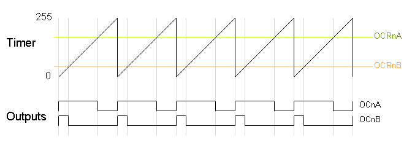

# Timer interruptions
These interrupts are used to trigger a specific action or event when a timer reaches a certain condition or value

## Timers 
The ATmega328P, a popular AVR microcontroller, has three timer/counters:

- Timer/Counter 0 `TC0`: Timer/Counter 0 is an 8-bit timer with PWM (Pulse Width Modulation) capability. It has two output compare registers (OCR0A and OCR0B) and supports PWM output on two pins: OC0A and OC0B. It's often used for basic timing and PWM applications.

- Timer/Counter 1 `TC1`: Timer/Counter 1 is a 16-bit timer with two 8-bit output compare registers (OCR1A and OCR1B) and one 16-bit input capture register (ICR1). It provides more precise timing and PWM control compared to Timer/Counter 0. Timer/Counter 1 also supports three PWM output pins: OC1A, OC1B, and OC1C.

- Timer/Counter 2 `TC2`: Timer/Counter 2 is another 8-bit timer with PWM capability. It has one output compare register (OCR2) and supports PWM output on one pin: OC2. Timer/Counter 2 is similar to Timer/Counter 0 but provides a separate timer resource.

## Prescaler
Prescaler is a divider that allows to reduce the clock frequency applied to the timer or counter. Atmega328P has clock `16 MHz`, and usually it's way too much than needed, but it's also possible to use external clock. Prescaler typically has next values: `1,8,64,256,1024`.

To set proper prescaler in `Timer/Counter 0` set next bits in `TCCR0B` register:

| CS02 | CS01 | CS00 | In hex | Description |
| ---- | ---- | ---- | ------ | ----------- |
| 0    | 0    | 1    | 0x01   | clk / 1     |
| 0    | 1    | 0    | 0x02   | clk / 8     |
| 0    | 1    | 1    | 0x03   | clk / 64    |
| 1    | 0    | 0    | 0x04   | clk / 256   |
| 1    | 0    | 1    | 0x05   | clk / 1024  |

To set proper prescaler in `Timer/Counter 1` set next bits in `TCCR1B` register:

| CS12 | CS11 | CS10 | In hex | Description |
| ---- | ---- | ---- | ------ | ----------- |
| 0    | 0    | 1    | 0x01   | clk / 1     |
| 0    | 1    | 0    | 0x02   | clk / 8     |
| 0    | 1    | 1    | 0x03   | clk / 64    |
| 1    | 0    | 0    | 0x04   | clk / 256   |
| 1    | 0    | 1    | 0x05   | clk / 1024  |


## Registers
Timer/Counter 0: 
- `TIMSK0` – Timer/Counter Interrupt Mask Register. This register used to set `Normal mode`, or `CTC mode` interruptions;
- `TCCR0A` – Timer/Counter Control Register A. This register used to set `Normal mode`, `CTC mode` or `PWM`. Default is normal mode;
- `TCCR0B` – Timer/Counter Control Register B. This register used to set `Prescaler`.
- `OCR0A` - Output Compare Register A. When `CTC mode` enabled, will compare to this value. This is a 8bit register, so max value is `255`;

Timer/Counter 1: 
- `TIMSK1` – Timer/Counter1 Interrupt Mask Register. This register used to set `Normal mode`, or `CTC mode` interruptions;
- `TCCR1A` - Timer/Counter1 Control Register A. Default is normal mode;
- `TCCR1B` - Timer/Counter1 Control Register B. This register used to set `CTC mode`;
- `OCR1A` - Output Compare Register A. When `CTC mode` enabled, will compare to this value. This is a 16bit register, so max value is `65536`;

## Vectors
Timer/Counter 0:
- `TIMER0_OVF_vect` - Overflow mode;
- `TIMER0_COMPA_vect` - CTC mode register A;

Timer/Counter 1:
- `TIMER1_OVF_vect` - Overflow mode;
- `TIMER1_COMPA_vect` - CTC Mode Register A;

## Normal Mode (Overflow Mode)
In this mode, the timer/counter counts from 0 to its maximum value (`255` for 8-bit timers and `65535` for 16-bit timers) and then overflows, generating an overflow interrupt (if enabled) and resetting the count. This mode is commonly used for basic timekeeping and interval timing. 

Keep in mind, if set same prescaler (for example `1024`) for `timer 0` and `timer 1`:
- timer 1 will trigger interruption `~11ms` (255 / (16e6 / 1024)), 255 - 8bit, 16e6 - 16Mhz atmega328P clock and 1024 - prescaler
- timer 1 will trigger interruption `~4.2s` (65536 / (16e6 / 1024)), 65536 - 16bit, 16e6 - 16Mhz atmega328P clock and 1024 - prescaler

Example for Timer 0 (8 bit);
```c
#include <avr/interrupt.h>

// Interrupt Service Routine (ISR) for Timer/Counter 0 overflow mode
ISR(TIMER0_OVF_vect) {
  // will run on interrupt
}

void setupTimer(void);

int main(void) {
  setupTimer();

  while (1);
}

void setupTimer(void) {
  TIMSK0 |= (1 << TOIE0); // Enable Overflow interrupt on timer 0 (TOIE0 Bit for Overflow mode interrupt)
  // TCCR0A |= 0x00; // Enable normal mode. No need to set as it is by default
  TCCR0B |= (1 << CS02) | (1 << CS00); // Set prescaler to 1024, or TCCR0B |= 0x05;

  sei();
} 
```

## CTC (Clear Timer on Compare match) Mode
In CTC mode, the timer counts up from 0 to a specific value, and when it reaches that value, it can automatically reset (clear) back to 0, generates compare match vector interrupt.

### Example for Timer 0 (8 bit)
```c
#include <avr/interrupt.h>

// Interrupt Service Routine (ISR) for Timer/Counter on compare match OCR0A register
ISR(TIMER0_COMPA_vect) {
  // will run on interrupt
}

void setupTimer(void);

int main(void) {
  setupTimer();

  while (1);
}

void setupTimer(void) {
  TIMSK0 |= 1 << OCIE0A; // Enable the compare match interrupt (OCIE0A Bit for Compare Match A interrupt)
  TCCR0A |= 1 << WGM01; // Set Timer/Counter 0 to CTC mode
  TCCR0B |= (1 << CS02) | (1 << CS00); // Set prescaler to 1024, or TCCR0B |= 0x05;

  OCR0A = 255; // Set OCR0A compare match value (max 255 as it is 8 bit register). 16Mhz / 1024 / 255 = 15625 times in second 

  sei();
} 
```

### Example for Timer 1 (16 bit)
```c
#include <avr/interrupt.h>


// Interrupt Service Routine (ISR) for Timer/Counter on compare match OCR1A register
ISR(TIMER1_COMPA_vect) {
  // will run on interrupt
}

void setupTimer(void);

int main(void) {
  setupTimer();

  while (1);
}

void setupTimer(void) {
  TIMSK1 |= 1 << OCIE1A; // Enable the compare match interrupt (OCIE0A Bit for Compare Match A interrupt)
  TCCR1B = (1 << WGM12); // Set Timer/Counter 0 to CTC mode
  TCCR1B |= (1 << CS12) | (1 << CS10); // Set prescaler to 1024;

  OCR1A = 15625; // Set OCR0A compare match value (max 255 as it is 8 bit register). 16Mhz / 1024 / 15625 = 1 times in second 

  sei();
} 
```

## PWM (Pulse Width Modulation)
Digital pin cannot reproduce analog value. Analogue value would be useful to control the brightness of an LED or the speed of a motor. Faking digital pin by switching on and off for fast speed can fake analog value.

### Duty cycle
Represents the ratio of time a signal is in an active or high state compared to the total period of the waveform.

Duty Cycle = (Total Period / Active Time)×100%

50% duty cycle means the LED is on for half the time and off for the other half, resulting in an average brightness level that is 50% of its maximum


### Fast PWM
Fast PWM is faster than phase correct PWM because fast PWM performs a single slope (i.e., up only) count. The output turns on when the timer is at 0, and turns off when the timer matches the output compare register. The higher the value in the output compare register, the higher the duty cycle.



```c
#include <avr/io.h>

const int ledPin = PD6;

void setup(void);
volatile int dutyCycleValue = 20; // 255 max

void setupExternalInterrupt(void);

int main(void) {
  setup();

  while (1);
}

void setup(void) {
  DDRD |= _BV(ledPin);

  TIMSK0 |= (1 << TOIE0); // timer 0 normal mode (8 bit)
  TCCR0B |= (1 << CS02) | (1 << CS00); // Set prescaler to 1024

  TCCR0A |= (1 << WGM00) | (1 << WGM01) | (1 << COM0A1); // FAST PWM
  OCR0A = dutyCycleValue;
}
```

### Phase Correct PWM (non-Fast PWM)
Phase correct PWM uses an up-then-down dual slope counting technique.