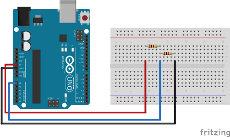

# Voltage Divider
A voltage divider is a simple circuit that consists of two resistors in series, dividing the voltage across them in proportion to their resistance values. The purpose of a voltage divider is to create a fraction of the input voltage.

The basic voltage divider circuit consists of two resistors, `R1` ​ and `R2` ​, connected in series between the input voltage (`Vin`) and ground (`GND`). The output voltage (`Vout`) is taken from the junction between the two resistors.

## Calculation

Calculator [link](https://ohmslawcalculator.com/voltage-divider-calculator)

## Circuit
