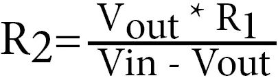

# Voltage Divider
A voltage divider is a simple circuit that consists of two resistors in series, dividing the voltage across them in proportion to their resistance values. The purpose of a voltage divider is to create a fraction of the input voltage.

The basic voltage divider circuit consists of two resistors, `R1` ​ and `R2` ​, connected in series between the input voltage (`Vin`) and ground (`GND`). The output voltage (`Vout`) is taken from the junction between the two resistors.

## Calculation




Calculator [link](https://ohmslawcalculator.com/voltage-divider-calculator)

## Circuit


## Program

```c
#include <avr/io.h>
#include <util/delay.h>

const uint8_t analogPinChannel = 0;
const float vcc = 5.0;

void setup(void);
uint16_t ADC_Read(uint8_t channel);
float ADC_Read_Voltage(uint8_t channel, float Vref);

int main(void) {
  setup();

  while(1) {
    float aValue = ADC_Read_Voltage(analogPinChannel, vcc);

    _delay_ms(1000);
  }
}

void setup(void) {
  // Set the voltage reference to AVcc
  ADMUX |= (1 << REFS0);
  // Set the ADC clock prescaler to 128 (ADC frequency = CPU frequency / 128)
  ADCSRA |= (1 << ADPS2) | (1 << ADPS1) | (1 << ADPS0);
  // Enable the ADC
  ADCSRA |= (1 << ADEN);
}

uint16_t ADC_Read(uint8_t channel) {
  // Clear the channel bits in ADMUX (0b11110000)
  ADMUX &= 0xF0; 
  // Set the new channel in ADMUX
  ADMUX |= channel;

  // Start the conversion
  ADCSRA |= (1 << ADSC);
  // Wait for the conversion to complete
  while (bit_is_set(ADCSRA, ADSC));

  // ADC result is a 10-bit value, so read ADCL and ADCH
  uint16_t result = ADCL | (ADCH << 8);

  return result;
}

float ADC_Read_Voltage(uint8_t channel, float Vref) {
  // Read the raw ADC value
  uint16_t ADC_Value = ADC_Read(channel);

  // ADC Resolution (e.g., 10 bits for most AVR microcontrollers)
  const uint16_t ADC_Resolution = 1023;

  // Convert ADC value to voltage
  float Voltage = (ADC_Value / (float)ADC_Resolution) * Vref;

  return Voltage;
}
```