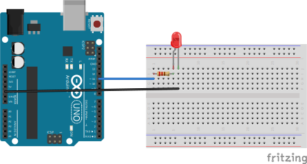

# External led every second
In this project external LED will toggle every second.

## Description
To have precise delay for interval, interruption on timer/clock 1 with `CTC mode` is used.

## Circuit
