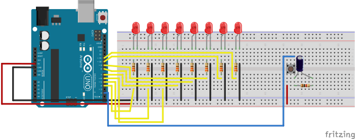

# BCD Timer start stop
In this project 8 external LEDs will count in BCD (binary-coded decimal) on button press. Next press will stop process.

## Description
Button uses hardware debounce with RC filter (resistor and capacitor). To increase counter every second, used
timer interruptions in CTC mode. For button click detection used INT external interruption.

## Circuit
