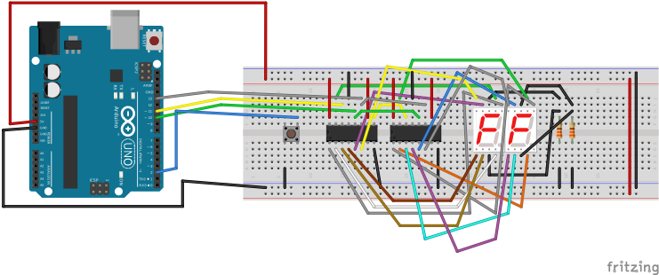

# Counter
In this project counter will increase value, with ability to reset.

## Description
For displaying counter value used two seven segment display with common cathode and controlled with one button. Short press - increment, long press - reset.

## Circuit
