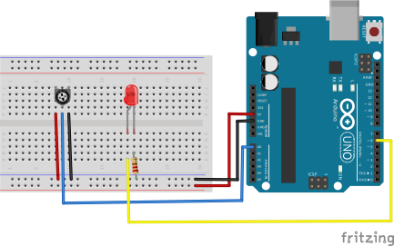

# LED dimmer with potentiometer
In this project pot will controller of brightness of led (dimmer). 

## Description
ADC (Analog to digital converter) will read analog value (0 to 1024 as it is 10-bit) and map to PWM (0 to 254 as it is 8-bit).

## Circuit
