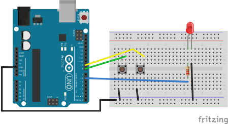

# Led Dimmer
In this project two buttons (down and up) will controller of brightness of led (dimmer). 

## Description
To simulate analog value of digital pin, used PWM. In this project used PWM with fast mode on time/clock 1.
Button press is handled by PCI interruptions. Plus to handle floating input built in resistor use, and for spurious open/close transitions used debounce technique software implementation to fix this problem.

## Circuit
