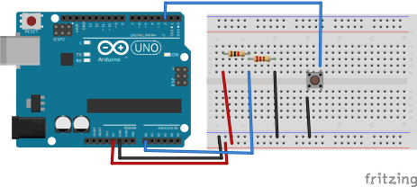

# UART Resistance Meter
In this project will find out unknown resistor resistance value. Result will be displayed in UART.

## Description
Using voltage divider circuit, will calculate value of unknown resistor using known resistor `1 kOm`.
UART baud rate - `19200`. Value will be calculated and displayed right after button click.

## Circuit
